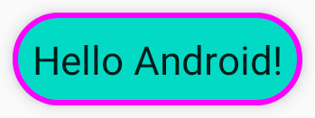
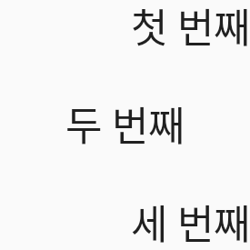
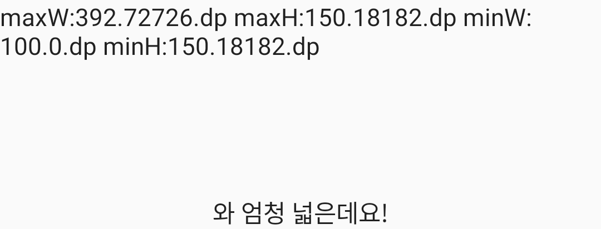
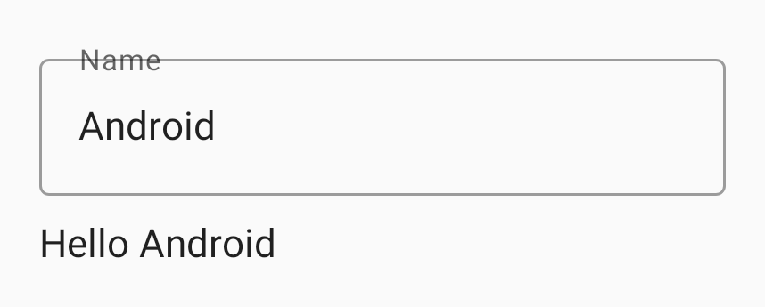
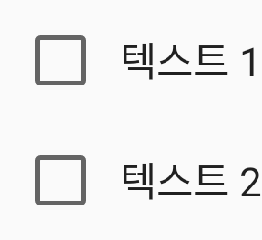
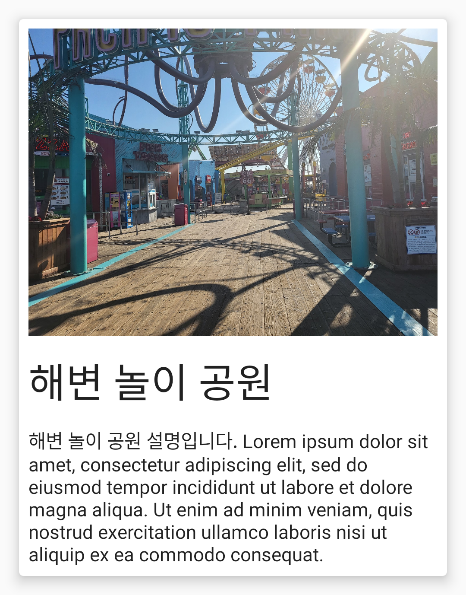
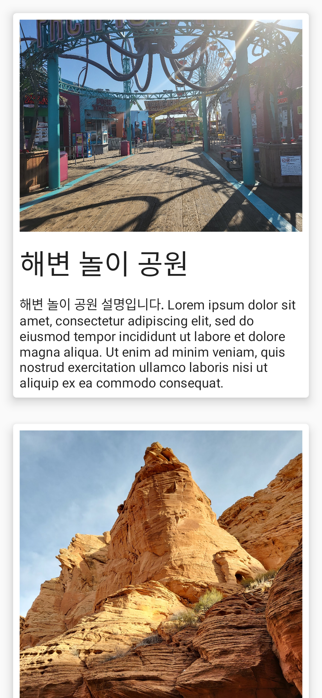

# Part4 Chapter3

Part4 Chapter3의 예제와 실습을 모두 담고 있습니다.

[최종본](../../tree/final)과 비교해보세요.

## Compose Text 실습코드 (part4-chapter3-2)

[part4-chapter3-2](part4-chapter3-2) 디렉토리를 Android Studio에서 오픈하세요.

Compose Text 실습코드

 * 스텝 1: 색상을 지정하기 위해 color 파라미터에 Color.Red를 전달해봅시다.
 * 스텝 2: Color 객체를 이용해서 해쉬값으로 색상을 전달해봅시다. (ARGB 순)
 * 스텝 3: fontSize 파라미터에 30.sp를 전달해봅니다.
 * 스텝 4: fontWeight에 FontWeight.Bold를 전달해봅시다.
 * 스텝 5: fontFamily에 FontFamily.Cursive를 전달해봅시다.
 * 스텝 6: letterSpacing에 2.sp를 지정해봅시다.
 * 스텝 7: maxLines를 2로 지정하고 문자열을 더 추가해봅시다.
 * 스텝 8: textDecoration에 TextDecoration.Underline을 추가합시다.
 * 스텝 9: textAlign을 TextAlign.Center로 지정합니다.

## Compose Button 예제 (part4-chapter3-3)

[part4-chapter3-3](part4-chapter3-3) 디렉토리를 Android Studio에서 오픈하세요.

Compose Button 예제

 * 스탭 1: Button을 클릭했을 때 Toast를 출력하게 만들어봅시다.
 * 스탭 2: Icon을 Text 앞에 추가시켜봅시다. imageVector에는 Icons.Filled.Send를 넣고 contentDescription에는 null을 넣어봅시다.
 * 스탭 3: 아이콘과 텍스트 사이에 Spacer를 넣어봅시다. modifier에 Modifier.size를 넣고 사이즈를 ButtonDefaults.IconSpacing을 지정합시다.
 * 스탭 4: enabled를 false로 바꾸어봅시다.
 * 스탭 5: border에 BorderStroke를 설정합시다.
 * 스탭 6: shape를 CircleShape로 지정합시다.
 * 스탭 7: contentPadding에 PaddingValues를 설정합시다.

## Compose Modifier 예제 (part4-chapter3-4)

[part4-chapter3-4](part4-chapter3-4) 디렉토리를 Android Studio에서 오픈하세요.

Compose Modifier 예제

 * 스텝 1: modifier에 Modifier.fillMaxSize()를 사용해봅시다.
 * 스텝 2: fillMaxSize대신 Modifier.height를 설정해봅시다.
 * 스텝 3: modifier에 height와 width를 같이 설정해봅시다.
 * 스텝 4: size에 width와 height를 인자로 넣을 수도 있습니다.
 * 스텝 5: background를 설정해봅시다. (버튼에서는 되지 않음.) Button에 되지 않으면 Text나 Icon에 지정해봅시다.
 * 스탭 6: colors 파라미터에 ButtonDefaults.buttonColors를 넣어보세요. backgroundColor와 contentColor 프로퍼티를 설정하세요.
 * 스텝 7: Button의 modifier에 padding을 추가해봅시다.
 * 스탭 8: Button에 enabled를 false로 설정하고, Text의 modifier에 clickable을 넣어봅시다.
 * 스탭 9: Text의 modifier에 offset를 설정하고 x 파라미터를 설정합니다.

## Compose Surface 예제 (part4-chapter3-5)

[part4-chapter3-5](part4-chapter3-5) 디렉토리를 Android Studio에서 오픈하세요.

Compose Surface 예제

 * 스텝 1: Surface에 elevation을 설정합시다.
 * 스텝 2: border의 값을 설정해봅시다.
 * 스텝 3: Surface의 shape도 설정해봅시다.
 * 스텝 4: color를 지정합시다.

MaterialTheme.colors에서 primary, error, background, surface, secondary 등을 지정해봅시다.

contentColor가 자동으로 선택됩니다.

## Compose Box 예제 (part4-chapter3-6)

[part4-chapter3-6](part4-chapter3-6) 디렉토리를 Android Studio에서 오픈하세요.

Compose Box 예제

 * 스텝 1: Text 두개를 Box 안에 배치해봅시다.
 * 스텝 2: 2개의 Box를 Box 안에 배치하고 사이즈를 70dp, 색상을 각기 다르게 해봅시다.
 * 스텝 3: 부모 Box에 modifier 설정을 제거해서 콘텐트 사이즈만큼 보여주게 합시다.
 * 그리고 첫번째 자식 Box의 사이즈를 matchParentSize()로 설정해봅시다. 
 * 다음에는 fillMaxSize()로 설정해봅시다.

## Compose Row 예제 (part4-chapter3-7)

[part4-chapter3-7](part4-chapter3-7) 디렉토리를 Android Studio에서 오픈하세요.

Compose Row 예제

 * 스텝 1: 각 Text의 modifier에 align을 설정합시다. Alignment.Top, CenterVertically, Bottom을 지정해봅시다.
 * 스텝 2: Row에 verticalAlignment를 설정해봅시다. Text에 align을 사용할 때와 쓰이는 값이 같습니다.
 * 스텝 3: Row의 height를 200dp 정도로 설정합시다. Row에 horizontalArrangement에 Arrangement.Center를
   설정해봅시다. Start, End, SpaceAround, SpaceBetween SpaceEvenly를 설정해봅시다.
 * 스텝 4: horizontalArrangement를 제거하고 각 Text에 Modifier.weight를 설정합시다. 
   각 항목의 weight 값을 바꾸어 보세요.
 * 스텝 5: Text 대신 Icon을 하나 넣어봅시다.

## Compose Column 예제 (part4-chapter3-8)

[part4-chapter3-8](part4-chapter3-8) 디렉토리를 Android Studio에서 오픈하세요.

Compose Column 예제

 * 스텝 1: horizontalAlignment를 Column에 적용해봅시다.
 * 스텝 2: Column에 verticalArrangement를 지정해봅시다. SpaceAround, SpaceEvenly, SpaceBetween도 해봅시다.
 * 스텝 3: Text에 Modifier.align을 사용해 봅시다.

## Compose Box with Constraints 예제 (part4-chapter3-9)

[part4-chapter3-9](part4-chapter3-9) 디렉토리를 Android Studio에서 오픈하세요.

Compose Box with Constraints 예제

 * 스텝 1: Inner 인자로 modifier를 전달해봅시다. 기본 값을 Modifier로 지정합시다.
  파라미터로 받은 modifier를 BoxWithConstrains에 전달합시다.
 * 스텝 2: Inner의 인자로 Modifier.widthIn(min = 100.dp)를 전달해봅시다. heightIn도 전달해봅시다. 각각 인자의 max값도 전달해봅시다.
 * 스텝 3: maxHeight 값이 150dp가 넘을 때만 추가로 텍스트를 출력해봅시다.
 * 스텝 4: Column에 width를 지정해서 제한해 봅시다.

## Compose Image 예제 (part4-chapter3-10)

[part4-chapter3-10](part4-chapter3-10) 디렉토리를 Android Studio에서 오픈하세요.

Compose Image 예제

 * 스텝 1: Image를 만들어봅시다. painter 항목에 painterResource(id = R.drawable.wall)
contentDescription에 엔텔로프 캐년이라고 넣읍시다.
 * 스텝 2: 두 번째 Image를 만들어봅시다. imageVector에 Icons.Filled.Settings를 설정해봅시다.

## Compose Coil 예제 (part4-chapter3-11)

[part4-chapter3-11](part4-chapter3-11) 디렉토리를 Android Studio에서 오픈하세요.

스텝 1: coil 의존성을 추가합니다.
 * 'io.coil-kt:coil:2.2.2' 의존성을 추가합니다.
 * 'io.coil-kt:coil-compose:2.2.2' 의존성도 추가합니다.

스텝 2: uses-permission에 android.permission.INTERNET를 추가합니다.

스텝 3: rememberImagePainter를 이용해 Image의 painter를 설정합니다. (Compose 한국어 문서의 추천, but Deprecated)
이미지 URI: https://raw.githubusercontent.com/Fastcampus-Android-Lecture-Project-2023/part4-chapter3/main/part-chapter3-10/app/src/main/res/drawable-hdpi/wall.jpg

스텝 4: AsyncImage를 이용해봅니다. model에 주소를 적으면 됩니다.

## Compose Card 예제 (part4-chapter3-12)

[part4-chapter3-12](part4-chapter3-12) 디렉토리를 Android Studio에서 오픈하세요.

 * 스텝 1: `AsyncImage`, `Spacer`, `Column`, `Text`로 레이아웃을 만들어보세요.
 * 스텝 2: `AsyncImage`에는 `placeholder`를 지정하고, `contentScale`을
   `ContentScale.Crop`으로 설정합시다.
   `clip(CircleShape)`로 둥근 외양을 만들어 봅시다.

## Compose Checkbox 예제 (part4-chapter3-13)

[part4-chapter3-13](part4-chapter3-13) 디렉토리를 Android Studio에서 오픈하세요.

 * 스텝 1: Checkbox를 만들어봅시다. checked 속성은 false, onCheckedChange는 비워둡시다.
 * 스텝 2: onCheckedChange에서 boolean 값 변수를 바꾸고 checked에서 그 값을 반영해봅시다. (잘 되지 않습니다.)
 * 스텝 3: boolean 대신 `remember { mutableStateOf(false) }`를 사용하여 상태를 도입합시다. (value 프로퍼티를 이용해야 합니다.)
 * 스텝 4: delegated properties로 변경해봅시다.
 * 스텝 5: destruction으로 상태를 받아서 사용해봅시다.

## Compose TextField 예제 (part4-chapter3-14)

[part4-chapter3-14](part4-chapter3-14) 디렉토리를 Android Studio에서 오픈하세요.

 * 스텝 1: TextField를 Text위에 만듭니다. value와 onValueChanged는 비워둡시다.
 * 스텝 2: Text에 Android 대신 TextField 입력을 출력하게 합시다. mutableStateOf("") 필드를 하나 만듭시다.
 * 스텝 3: TextField에 label을 추가합시다.내용에는 `Text("Name")`을 채워봅시다.
 * 스텝 4: TextField와 Text 사이에 Spacer를 넣어 8.dp 간격을 줍시다.
 * 스텝 5: TextField를 OutlinedTextField로 변경해봅시다.

## Compose TopAppBar 예제 (part4-chapter3-15)

[part4-chapter3-15](part4-chapter3-15) 디렉토리를 Android Studio에서 오픈하세요.

 * 스텝 1: TopAppBar를 만들고 title 항목을 채워봅시다.
 * 스텝 2: navigationIcon 파라미터를 채워봅시다. IconButton을 만들고 자식으로 Icon을 넣읍시다.
  아이콘은 Icons.Filled.ArrowBack을 채웁시다. onClick은 비워둡시다.

 * 스텝 3: actions를 추가해봅시다. Icons.Filled의 여러 아이콘을 이용해봅시다.
 * 스텝 4: TopAppBar content 파라미터 버전을 만들어봅시다.

## Compose Slot 예제 (part4-chapter3-16)

[part4-chapter3-16](part4-chapter3-16) 디렉토리를 Android Studio에서 오픈하세요.

 * 스텝 1: `Row`를 `@Composable` 함수로 분리합시다. `checked`의 값,
  `Text`의 `text`를 인자로 전달합시다.

 * 스텝 2: `@Composable` 함수에서 `@Composable () -> Unit` 타입으로
 `content`를 받아옵시다. `Row`의 `Text`를 뺴고 `content()`를 넣읍시다.
 `Row`에 `Modifier.clickable`를 넣어 전체를 클릭가능하게 합시다.

 * 스텝 3: `content`의 타입을 `@Composable RowScope.() -> Unit`로
 바꿉시다. 이렇게 다른 콤포저블 컨텐트를 넣는 방식을 Slot API라 합니다.

 * 스텝 4: 상태를 바꾸는 람다를 `@Composable` 함수의 인자로 뺍시다.
 인자에서 MutableState대신 boolean 값으로 변경합시다.

## Compose Scaffold 예제 (part4-chapter3-17)

[part4-chapter3-17](part4-chapter3-17) 디렉토리를 Android Studio에서 오픈하세요.

 * 스텝 1: `topBar`를 `TopAppBar`로 채워 봅시다.
 * 스텝 2: 아래에 CheckBoxWithContent를 넣어봅시다.

## Compose Catalog 예제 (part4-chapter3-18)

[part4-chapter3-18](part4-chapter3-18) 디렉토리를 Android Studio에서 오픈하세요.

 * 스텝 1: `catalog1.png`를 참고해 카드 레이아웃을 완성하세요.
 * 스텝 2: 스텝 2: `items(itemList)`를 이용해 Item을 반복해서 컬럼에 추가하세요.